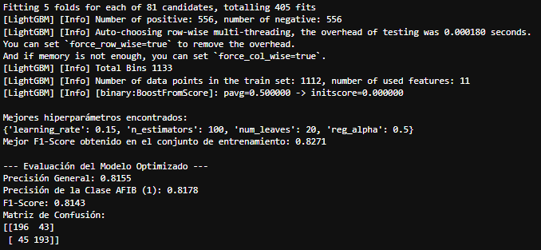
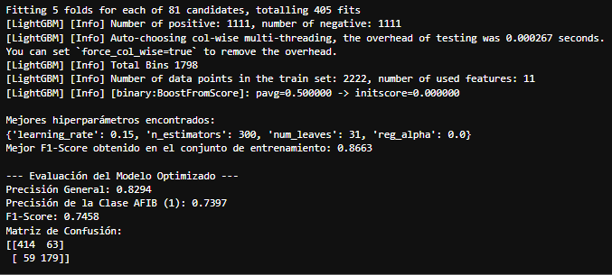

[Versión en Español](README.md)

# Detection-of-Atrial-Fibrillation-AFIB-using-ML 🫀

This bioinformatics and data science project presents a comprehensive and robust pipeline for detecting atrial fibrillation from Holter recordings. It demonstrates the ability to process large volumes of raw ECG signal data, extract relevant biomedical features, and train a high-accuracy machine learning model to identify this common arrhythmia.  

The main objective is to build a predictive model that can differentiate between normal heartbeats and those associated with AFIB, an important element for the automation of medical diagnosis.

## Data Source 💾

This dataset is publicly available for research. Details are described in the following citations. Important: include this citation if you plan to use this database:

> Tsutsui, K., Biton Brimer, S., & Behar, J. (2025). SHDB-AF: a Japanese Holter ECG database of atrial fibrillation (version 1.0.1). PhysioNet. RRID:SCR_007345. https://doi.org/10.13026/n6yq-fq90

> Tsutsui, K., Brimer, S.B., Ben-Moshe, N. et al. SHDB-AF: a Japanese Holter ECG database of atrial fibrillation. Sci Data 12, 454 (2025). https://doi.org/10.1038/s41597-025-04777-4

> Goldberger, A., Amaral, L., Glass, L., Hausdorff, J., Ivanov, P. C., Mark, R., ... & Stanley, H. E. (2000). PhysioBank, PhysioToolkit, and PhysioNet: Components of a new research resource for complex physiologic signals. Circulation [Online]. 101 (23), pp. e215–e220. RRID:SCR_007345.  

## Technologies Used 🐍
-   Pandas & NumPy: For large-scale data manipulation, cleaning, and analysis.
-   WFDB: A specialized library for reading signals and annotations from biomedical databases, such as the Holter database from the PhysioNet/Computing in Cardiology competition.
-   Scikit-learn: For data splitting, model validation, and performance metric evaluation.
-   Imblearn (imbalanced-learn): For applying the SMOTE oversampling technique to the training set.
-   LightGBM: A high-performance Gradient Boosting implementation used to build the classification model.
-   Matplotlib & Seaborn: For data visualization and model results.  

## Consideraciones en Instalación ⚙️

To set up and run this project, i recommend using a `conda` environment. These libraries will help you create the necessary environment:

bash
    ```
    pip install pandas numpy wfdb scikit-learn lightgbm seaborn matplotlib imblearn pyarrow
    ```  
    
Data Configuration: Ensure that the PhysioNet/Computing in Cardiology competition data files are located in the folder you are working with within the project structure.
Run the Script: Simply run the main script (or the cells in your notebook) to execute the processing, modeling, and evaluation pipeline.

## Note ⚠️
To manage this type of data, it is necessary to understand that the more data you have, the more processes you need to implement to manage it, especially considering its respective formats. In this case, there are 8.27 GB of data, so you need to consider a strategy (included in the script) to process it according to the equipment you are working with. Efficiency and care in starting the project are crucial so that you can perform the necessary tests and applications.  

## Usage Example 📎

The data pipeline successfully processes **+10 million heartbeats** from 80 patients, unifying ECG signal data with clinical information (a balance in the amount of data must be considered). Key features included:  

-   RR interval statistics (`rr_interval`, `rr_std_5_beats`).
-   Distribution statistics (`rr_mean`, `rr_median`, `rr_skew`, `rr_kurtosis`).
-   Patient clinical data (`Age_at_Holter`, `Sex`, `HTN`, `CHF`).

After training an optimized `LightGBM` model with a 1:1 sampling strategy, the key results on the test set were as follows:




We decided to compare the test of a training with an unbalanced DataFrame and obtained this difference:




## Contributions 🖨️

If you're interested in contributing to this project or using it independently, consider:
-   Forking the repository.
-   Creating a new branch (git checkout -b feature/your-feature).
-   Making your changes and committing them (git commit -am 'Add new feature').
-   Pushing your changes to the branch (git push origin feature/your-feature).
-   Opening a 'Pull Request'.

## License 📜

This project is under the MIT License. Refer to the LICENSE file (if applicable) for more details.
