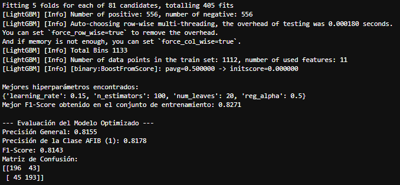
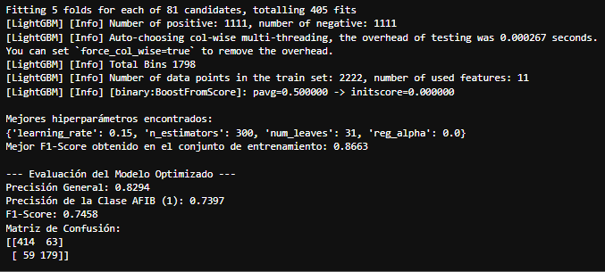
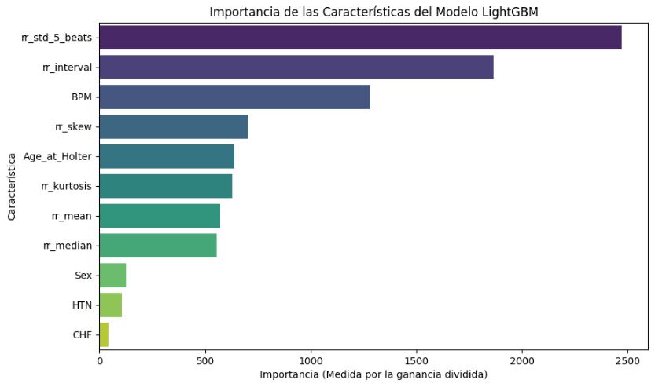

# Deteccion-de-Fibrilacion-Auricular-AFIB-usando-ML 🫀

Este proyecto de bioinformática y ciencia de datos presenta un pipeline completo y robusto para la detección de la fibrilación auricular a partir de grabaciones de Holter. Demuestra la capacidad de procesar grandes volúmenes de datos brutos de señales de ECG, extraer características biomédicas relevantes y entrenar un modelo de machine learning de alta precisión para identificar esta arritmia común.  

El objetivo principal es construir un modelo predictivo que pueda diferenciar entre latidos cardíacos normales y aquellos asociados con la AFIB, un elemento importante para la automatización del diagnóstico médico.

## Fuente de Datos 💾

Este conjunto de datos está disponible públicamente para investigación. Los detalles se describen las siguientes citaciones. Importante, incluye esta cita si planeas usar esta base de datos:

> Tsutsui, K., Biton Brimer, S., & Behar, J. (2025). SHDB-AF: a Japanese Holter ECG database of atrial fibrillation (version 1.0.1). PhysioNet. RRID:SCR_007345. https://doi.org/10.13026/n6yq-fq90

> Tsutsui, K., Brimer, S.B., Ben-Moshe, N. et al. SHDB-AF: a Japanese Holter ECG database of atrial fibrillation. Sci Data 12, 454 (2025). https://doi.org/10.1038/s41597-025-04777-4

> Goldberger, A., Amaral, L., Glass, L., Hausdorff, J., Ivanov, P. C., Mark, R., ... & Stanley, H. E. (2000). PhysioBank, PhysioToolkit, and PhysioNet: Components of a new research resource for complex physiologic signals. Circulation [Online]. 101 (23), pp. e215–e220. RRID:SCR_007345.  

## Tecnologias usadas 🐍
-   Pandas & NumPy: Para la manipulación, limpieza y análisis de datos a gran escala.
-   WFDB: Una librería especializada para la lectura de señales y anotaciones de bases de datos biomédicas, como la base de datos de Holter de la competencia PhysioNet/Computing in Cardiology.
-   Scikit-learn: Para la división de datos, la validación del modelo y la evaluación de métricas de rendimiento.
-   Imblearn (imbalanced-learn): Para aplicar la técnica de sobremuestreo `SMOTE` en el conjunto de entrenamiento.
-   LightGBM: Una implementación de `Gradient Boosting` de alto rendimiento, utilizada para construir el modelo de clasificación.
-   Matplotlib & Seaborn: Para la visualización de datos y los resultados del modelo.  

## Consideraciones en Instalación ⚙️

Para configurar y ejecutar este proyecto, se recomienda utilizar un entorno `conda`. Estas librerias te ayudarán a crear el entorno necesario:

bash
    ```
    pip install pandas numpy wfdb scikit-learn lightgbm seaborn matplotlib imblearn pyarrow
    ```  
    
Configuración de Datos**: Asegúrate de que los archivos de datos de la competencia PhysioNet/Computing in Cardiology esten ubicados en la carpeta con la que trabajas dentro de la estructura del proyecto.  
Ejecutar el Script**: Simplemente corre el script principal (o las celdas de tu notebook) para ejecutar el pipeline de procesamiento, modelado y evaluación.

## Nota ⚠️
Para el manejo de este tipo de datos, es necesario entender que entre mas cantidad de datos se tiene, mas procesos para manejarlos se deben implementar sobre todo considerando sus respectivos formatos; para este caso son 8.27 GB de datos, por lo que se debe considerar una estrategia (incluida en el script) para poder procesarlos segun el equipo con el que trabajes. La eficiencia y cuidado para inciar el proyecto es crucial para que puedas hacer las pruebas y aplicaciones necesarias.  

## Ejemplo de Uso 📎

El pipeline de datos procesa con éxito **+10 millones de latidos** de 80 pacientes, unificando datos de señales de ECG con información clínica (se debe considerar un balance en la cantidad de datos). Las características principales incluyeron:

-   Estadísticas del intervalo RR (`rr_interval`, `rr_std_5_beats`).
-   Estadísticas de la distribución (`rr_mean`, `rr_median`, `rr_skew`, `rr_kurtosis`).
-   Datos clínicos del paciente (`Age_at_Holter`, `Sex`, `HTN`, `CHF`).

Después de entrenar un modelo `LightGBM` optimizado con una estrategia de muestreo 1:1, los resultados clave en el conjunto de prueba fueron los siguientes:




Considerarmos constrastar la prueba de un entrenamiento con un DataFrame desbalanceado y obtuvimos esta diferencia:






## Contribuciones 🖨️

Si te interesa contribuir a este proyecto o usarlo independiente, considera:
-   Hacer un "fork" del repositorio.
-   Crear una nueva rama (`git checkout -b feature/su-caracteristica`).
-   Realizar tus cambios y "commiteelos" (`git commit -am 'Agrega nueva característica'`).
-   Subir los cambios a la rama (`git push origin feature/su-caracteristica`).
-   Abrir un "Pull Request".

## Licencia 📜

Este proyecto está bajo la Licencia MIT. Consulta el archivo LICENSE (si aplica) para más detalles.


[English Version](README.en.md)

